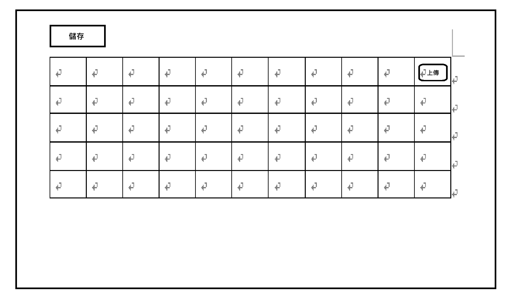

# 規定
任何操作請都只能在此專案下，若需要在此專案外，請先告訴我
# Form Attachment Practice
前端: react + vite  
UI套件: tailwindcss、ant-design、aggrid 最新版  
後端: springboot 3，暫時不用 DB，可以先用輕量 sql 資料

## 需求說明
1. 系統有許多表單，在主頁面會查詢出目前的所有表單，表格欄位包含單號、最新更新者、更新時間，點按單號欄位後會進入該表單
2. 進入表單後，會詳細列出表單的資訊，每個表單主要有一個資料表，假設有11個欄位(用欄位1、2...10這樣暫定欄位的名字)，第11個欄位是附件上傳(欄位名:附件)，每張表單內的每筆資料都可以選擇是否上傳附件
    - 2.0 ，圖片只是稍微說明。
    - 2.1 而每張表單內的每筆資料都有一個屬性叫做 attId，用以對應到儲存在伺服器的檔案(以此專案是伺服器做模擬)，會根據 attId 到本專案的 /Attachments 資料夾下創立資料夾將對應的該筆資料的附件檔案存入
    - 2.2 但為了不要在系統中有很多孤兒檔案，在表單詳細資料畫面上有一個 save 按鈕，用以儲存他編輯過的表單，按下 save 過後，才會將上傳的檔案實際存下來，否則應該是暫存在瀏覽器中(可能用 react,redux 等的方式存下)
    - 2.3 而第 11 個欄位附件，在表格每筆資料中是一個按鈕，點按按鈕後會跳出一個視窗，會預覽此筆資料目前的檔案，此視窗會有一個上傳按鈕，點了可以上傳電腦上的檔案，選完後會在視窗中的一個表格顯示他上傳的紀錄，包含檔名，時間，上傳者，且每筆資料可能有多個附件，可以上傳很多檔案，但實際存到伺服器要點 save 才會有，但因為還沒重新整理網頁，若有先暫時上傳，離開上傳視窗，再點開該筆資料，應該要留著上傳的紀錄，若有上傳檔案，則在表格的詳細內容會寫: 此筆有上傳檔案的文字，而每個附件也都會有一個下載、刪除的欄位Action，用來表示刪除、下載，且刪除我希望也是暫時刪除，沒有真的刪除附件，也是要關閉此視窗，回到主詳細表格頁面點按 save 才會真的刪除
    - 2.4 表格的第1~10欄位也都是可編輯欄位，都是字串類型，這些欄位也是沒按下 save 的話，就是暫存而已，一旦離開表單，資料都會被清除
    - 2.5 請使用 AG-grid 撰寫詳細資料表格，以及上傳檔案的表格

## 我的疑問
1. 請幫我找找是否有合適的套件用來處理這樣的表格內附件的上傳下載操作，若沒有，可以自己實作，若有推薦的套件，請告訴我原因(評估指標: NPM 上很多人下載/有很棒的功能廣為流傳/為近幾年的套件)，或是根據你的評估有其他更好的方式
2. 針對這些檔案操作使用 redux 做儲存是否好?

## remark:
1. 資料持久化方式: SQLite
2. 附件儲存路徑: 對，就是 FormAttachmentPractice/Attachments/{attId}/xxx.pdf
3. attId 產生時機: 當使用者有真的針對某筆資料進行檔案上傳暫存到瀏覽器後，就會產生一個 attId 到此表格的欄位資料中(表格資料應該是一個暫存在前端 redux(之類的)狀態，若有按下 save，才會回寫到後端資料存入到該張表單的對應資料的attId 下，之所以不再表格一被建立就針對每筆資料都有 attid，是因為不一定每筆資料都有上傳檔案
4. Save 行為: 先做「整張表單一起送」，邏輯比較清楚
5. 附件刪除規則: 顯示「待刪除」狀態，使用者比較不會困惑，也比較方便 Undo，那他如果點了刪除，就會顯示待刪除，將待刪除這邊設定成一個按鈕，點按後可以取消刪除
6. 下載規則: 對尚未 Save 的暫存附件：也允許下載/預覽
7. 離開表單的行為: 跳確認視窗，點選確定才真的清除並離開
8. 使用者資訊: 最新更新者、上傳者 先寫死成一個假使用者嗎: test-user
9. 檔案限制: 先不限制檔案類型，預設單檔最大 10MB
10. 專案建立範圍: 前後端都須從頭建立，並請使用 docker 來容器化，幫我撰寫 dockerFile，且將前端打包進後端做啟動，整個專案請以 /src 往下，前端放在 src/frontend，後端放在 src/backend
11. 需求變成每個表單的詳細頁面都有一個 tab 用來切換分頁，每個分頁都有一個表格資料，目前暫定每個表單的詳細資料都會包含 tab 且 tab 有三個
12. 每個 tab 底下會有一張表格，表格就一樣有11個欄位
13. 上傳下載等的行為都與以前相同
14. 針對 FormRow 的 type，我希望attachments 變成 attachmentId:string， 然後會去後端問回該 attid 下有的檔案們
15. 若是一筆資料他目前還沒有附件，則會到按下 save 的時候，針對對應的該筆資料去問一個 attid，再存入檔案
16. 針對 attid 的生成我希望變成是透過問後端 api，用一個 api 來生成這個 attid

## 需求更新
1. 每個分頁現在多了一個 + 按鈕，按了可以新增一筆資料
2. 新增的資料也需要配合目前既有的上傳下載等模式

## new remark
1. 基於此新需求，請幫我評估是否有需要調整之前的設計